# Padala Vision

Padala Vision is a Blockchain × AI delivery escrow platform that combines **Stellar-powered settlement** with **AI-assisted verification** to make delivery transactions secure, transparent, and dispute-ready.

It ensures:
- payments (including **abono / partial payments**) are safely held in escrow
- delivery is tracked step-by-step
- proof is verified using AI
- disputes are resolved with real, trusted evidence

Funds are only released when delivery is truly confirmed.

---

## Why This Matters

A rider accepts a delivery — but to secure the item, he pays an **abono** out of his own pocket.

He delivers the package.  
Then something goes wrong.

The buyer says it never arrived.  
The seller refuses to release the item.

Now the rider loses money.  
The seller loses trust.  
The buyer walks away.

No proof. No protection. No fair resolution.

**Padala Vision fixes this.**

By turning every step — payment, delivery, and proof — into a verifiable system, it protects everyone involved, especially the one who risks the most.

---

## 📸 UI Screenshots

All screenshots are located in the `assets/` folder.

### 🏠 Landing Page

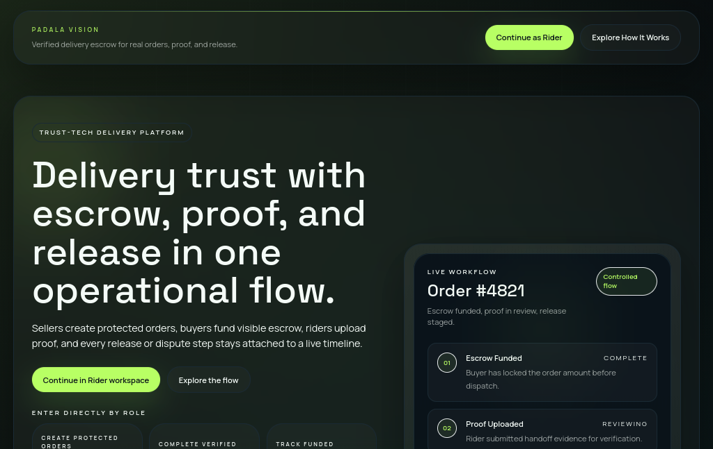
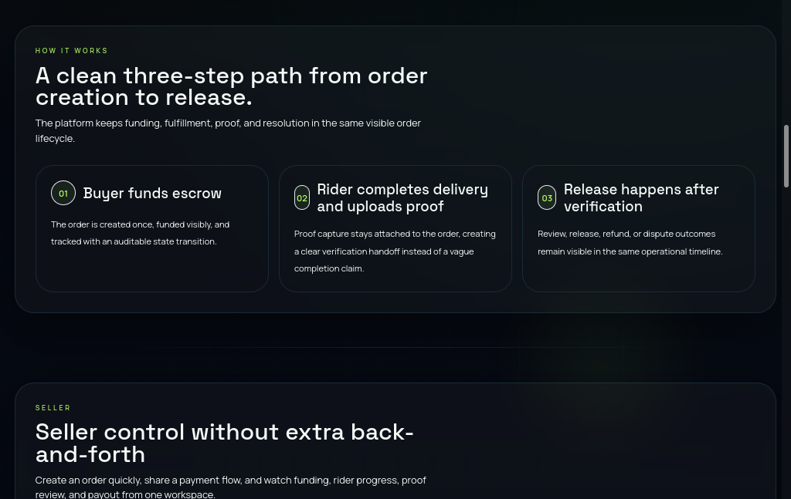
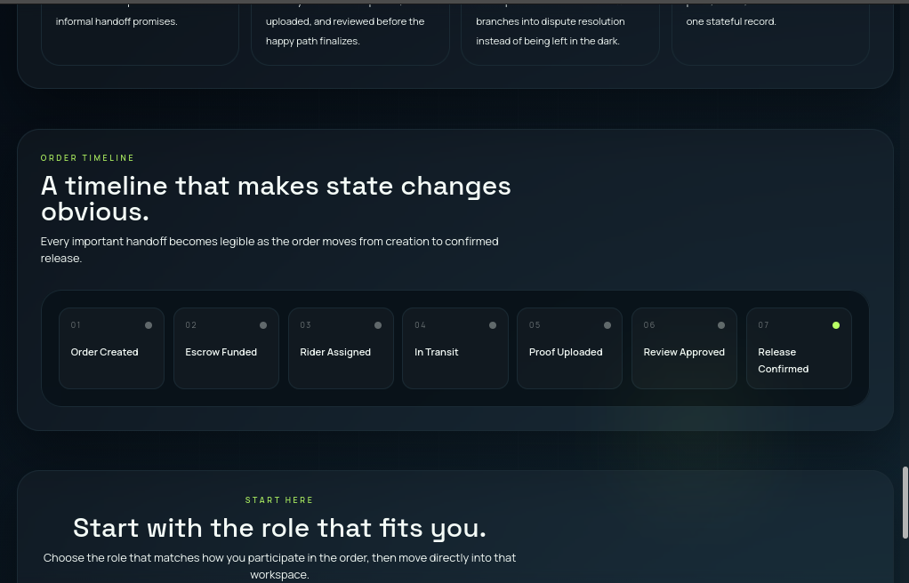

---

### 🔗 Wallet / Binding Flow

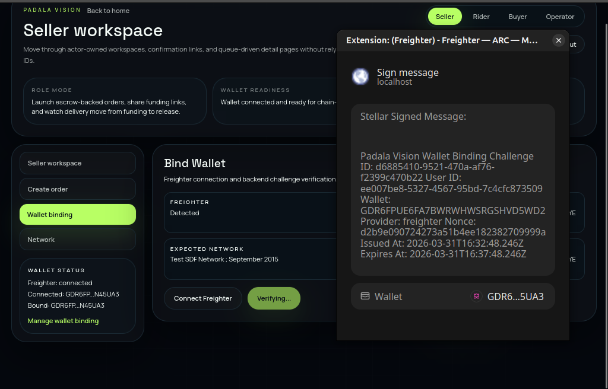
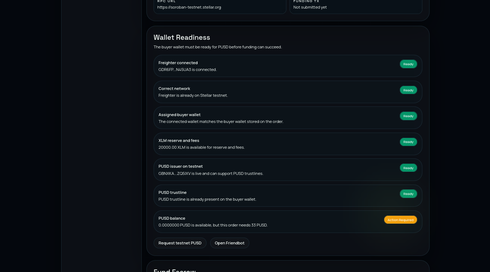


---

### 🧑‍💼 Seller Workspace

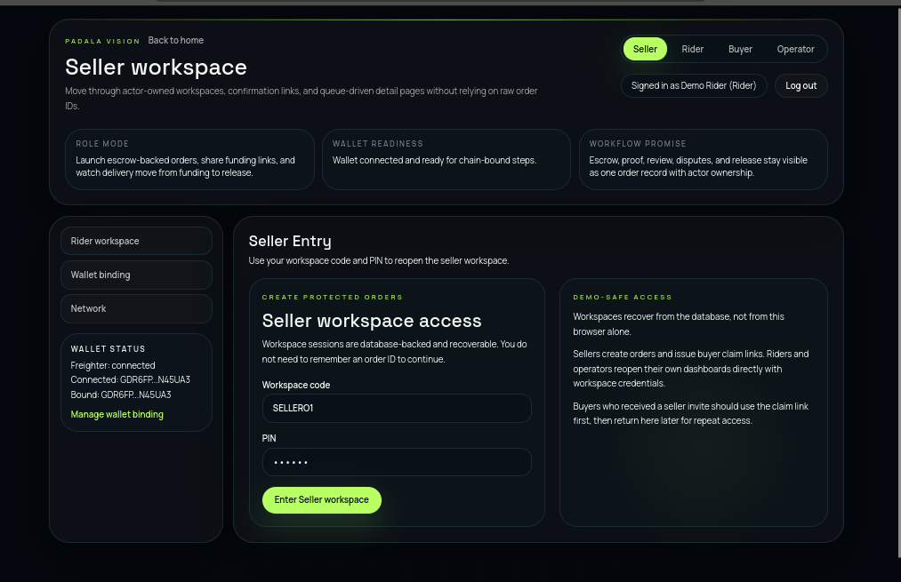
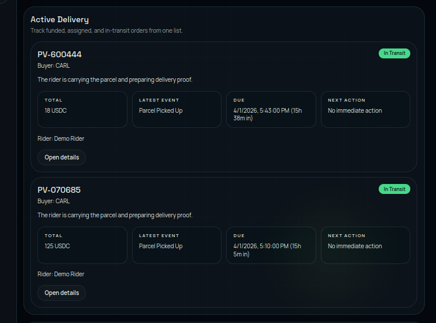


---

### 📝 Create Order

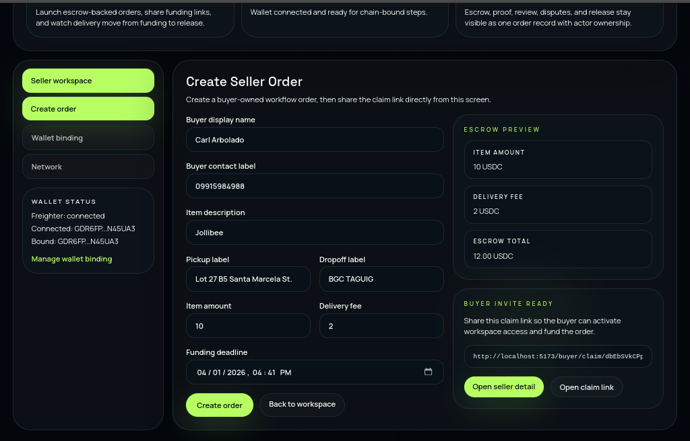

---

### 🔗 Buyer Access Link

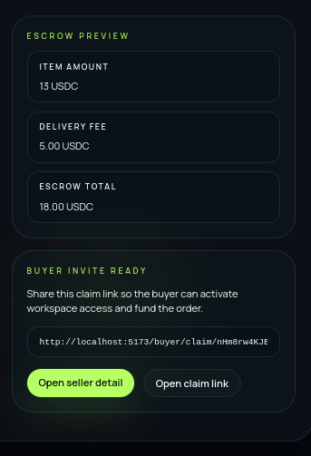


---

### 🚴 Rider Workspace

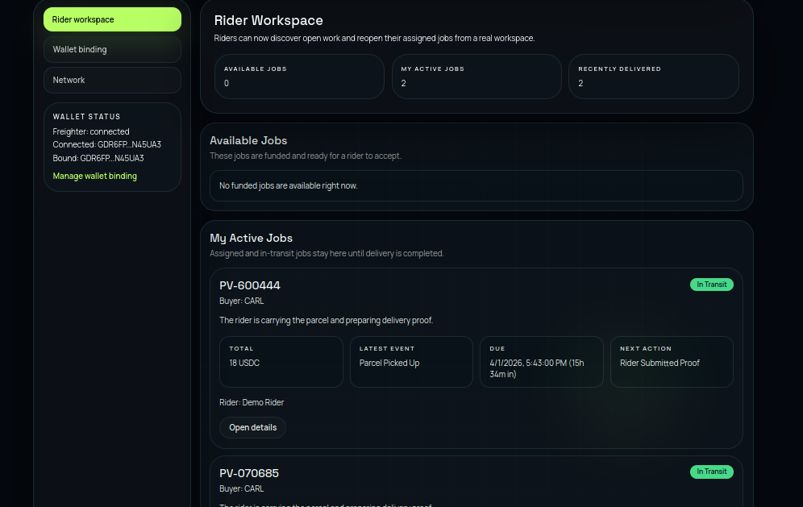
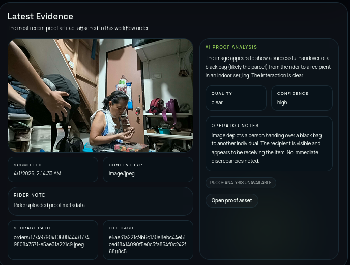

---

### 🛠 Operator Workspace

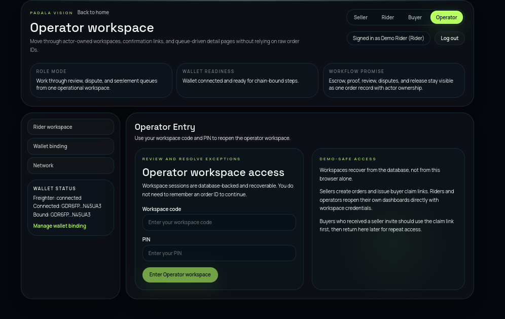

---

### 📜 Smart Contract


**Stellar Expert Link:**  
https://stellar.expert/explorer/testnet/contract/CBT3U4Y74Z5UD5IVCVLCDINDZW4BIKYCQUEVQXOJ3TNEISYWQRT64R6M

**Contract Address:**  
`CBT3U4Y74Z5UD5IVCVLCDINDZW4BIKYCQUEVQXOJ3TNEISYWQRT64R6M`

The Soroban contract handles:
- escrow custody
- release verification
- dispute freezing
- refund conditions

The backend coordinates workflow, while the contract enforces settlement guarantees.

---

## 🚀 What Problem We Solve

Delivery-based transactions today rely on:
- manual updates in chat
- weak or unverifiable proof of delivery
- early payments without guarantees
- unclear dispute handling

This creates risk for:
- buyers (paying before delivery)
- sellers (non-payment risk)
- riders (unclear completion proof)
- operators (no structured resolution system)

---

## 💡 The Solution

Padala Vision introduces a **structured delivery escrow workflow**:

1. Seller creates an order
2. Buyer funds escrow
3. Rider accepts and delivers
4. Rider uploads proof
5. Buyer confirms or rejects delivery
6. Operator handles exceptions
7. System releases or refunds funds

---

## 🏆 Why This Project Stands Out

Padala Vision is not just a delivery app or an escrow system — it combines both into a single workflow.

What makes it unique:
- Combines **Blockchain (trust in money)** + **AI (trust in proof)**
- Introduces **buyer confirmation as a required step**, not optional
- Adds **operator review for real-world edge cases**
- Uses **workspace-based role flows** instead of a purely wallet-only experience
- Designed for **real-world use**, not just on-chain interaction

It bridges the gap between:
- delivery apps (no trust layer)
- escrow systems (no real-world operational workflow)

This makes it practical, scalable, and production-relevant.

---

## ⚙️ How Padala Vision Works

Padala Vision is built around four roles:

### Seller
Creates orders and defines delivery details.

### Buyer
Funds escrow and confirms delivery.

### Rider
Executes delivery and submits proof.

### Operator
Handles disputes and manual reviews.

### Order Lifecycle

- awaiting funding
- funded
- rider assigned
- in transit
- awaiting buyer confirmation
- resolved (released or refunded)

All actions are recorded and linked to settlement events.

---

## 🔗 Why Blockchain × AI

### Blockchain (Stellar / Soroban)
- Escrowed funds are securely held until completion
- Settlement (release/refund) is verifiable and tamper-resistant
- Removes trust dependency between parties

### AI (Gemini)
- Reviews delivery evidence
- Generates summaries and risk signals
- Assists operator decision-making

> AI is assistive only — final decisions remain with buyers and operators.

---

## 🧠 Core Features

- Escrow-based delivery system
- Multi-role workflow (Seller / Buyer / Rider / Operator)
- Proof-based delivery verification
- Buyer confirmation before release
- Operator dispute resolution
- Gemini-assisted evidence review
- Stellar-backed settlement

---

## 🔐 Core Rules Enforced By The System

- Funds cannot be released without buyer confirmation or operator approval
- Only assigned riders can submit delivery proof
- Only buyers can confirm or reject delivery
- Disputes require operator resolution
- Escrow protects funds during delivery
- All actions are logged and traceable

---

## 🧱 Architecture Overview

Padala Vision is built as a full-stack system:

- **Frontend:** React + Vite + TypeScript
- **Backend:** Express + TypeScript
- **Database:** Supabase (orders, actors, evidence, history)
- **Blockchain:** Stellar / Soroban (escrow + settlement)
- **AI Layer:** Gemini (evidence review + summaries)

---

## 📡 Contract API Reference

`create_order(seller, buyer, amount, details)`  
Creates a new escrow order

`fund_order(buyer, order_id)`  
Locks funds into escrow

`accept_job(rider, order_id)`  
Assigns a rider

`submit_proof(rider, order_id, evidence)`  
Uploads proof

`confirm_delivery(buyer, order_id)`  
Triggers release

`reject_delivery(buyer, order_id)`  
Opens dispute

`release_funds(order_id)`  
Releases escrow

`refund(order_id)`  
Refunds buyer

---

## 🧪 CLI Example

```bash
stellar contract invoke \
  --id <CONTRACT_ID> \
  --source seller \
  --network testnet \
  -- create_order \
  --seller <SELLER_ADDRESS> \
  --buyer <BUYER_ADDRESS> \
  --amount 10000000
```

---

## 🛠 Tech Stack

- **Frontend:** React + Vite + TypeScript
- **Backend:** Express + TypeScript
- **Database / Storage:** Supabase (Postgres + Storage)
- **Blockchain:** Stellar / Soroban
- **AI Layer:** Gemini
- **Wallet:** Freighter Wallet

---

## ⚙️ Prerequisites

Make sure the following are installed before running the project:

- Node.js
- npm or pnpm
- Stellar CLI
- Rust toolchain (for smart contract development)
- Freighter Wallet browser extension

---

## 📁 Repo Structure

```text
.
├── frontend/
├── backend/
├── shared/
├── contract/
└── readme.md
```

---

## ⚙️ How to Clone and Use It

This section is for judges, public users, or future developers who want to run Padala Vision locally using their **own** setup.

### 1. Clone and install

```bash
git clone https://github.com/Kaido147/stellar-bootcamp-padala-vision.git
cd stellar-bootcamp-padala-vision
npm install
cp backend/.env.example backend/.env
cp frontend/.env.example frontend/.env
```

---

### 2. Create a Supabase project

Create your own Supabase project, then collect these values from the Supabase dashboard:

- `SUPABASE_URL`
- `SUPABASE_SERVICE_ROLE_KEY`
- `VITE_SUPABASE_ANON_KEY`

Notes:
- `SUPABASE_SERVICE_ROLE_KEY` is secret and must only be used in `backend/.env`
- `VITE_SUPABASE_ANON_KEY` is the public frontend key
- Do not commit either key into the repository

---

### 3. Set up Supabase schema and seed data

Run these SQL files in your Supabase SQL editor, in this exact order:

1. `backend/supabase/bootstrap.sql`
2. `backend/supabase/demo-seed.sql`
3. `backend/supabase/contract-registry-seed.sql`

What these files do:

- `bootstrap.sql` creates the current required schema
- `demo-seed.sql` creates the demo seller, rider, and operator accounts
- `contract-registry-seed.sql` inserts the active `staging` blockchain configuration

Notes:
- Historical migrations are still kept in `backend/supabase/migrations` for development history, but public users do **not** need to run them one by one
- The backend creates the `delivery-evidence` storage bucket automatically on first proof upload
- The app uses the active `staging` row in `contract_registry` as the source of truth for blockchain configuration

---

### 4. Configure `backend/.env`

Start from `backend/.env.example` and fill in your values.

#### Required backend values

```env
PORT=4000
APP_ENV=staging
SUPABASE_URL=https://your-project-ref.supabase.co
SUPABASE_SERVICE_ROLE_KEY=your-supabase-service-role-key
ACTOR_SESSION_HMAC_SECRET=replace-with-a-random-long-secret
SUPABASE_STORAGE_BUCKET=delivery-evidence
ORACLE_PROVIDER=auto
STELLAR_RPC_URL=https://soroban-testnet.stellar.org
STELLAR_NETWORK_PASSPHRASE=Test SDF Network ; September 2015
```

Generate `ACTOR_SESSION_HMAC_SECRET` locally with either:

```bash
openssl rand -hex 32
```

or

```bash
node -e "console.log(require('crypto').randomBytes(32).toString('hex'))"
```

#### Optional / advanced backend values

These can be left blank for a basic local setup:

```env
GEMINI_API_KEY=
ORACLE_SECRET_KEY=
ORACLE_PUBLIC_KEY=
ORACLE_CONFIDENCE_THRESHOLD=0.8
ATTESTATION_TTL_SECONDS=900
WALLET_CHALLENGE_TTL_SECONDS=300
ACTOR_SESSION_COOKIE_NAME=padala_actor_session
USDC_CONTRACT_ID=
PADALA_ESCROW_CONTRACT_ID=
TOKEN_ADMIN_SECRET=
```

What they are for:

- `GEMINI_API_KEY` — optional AI analysis
- `ORACLE_SECRET_KEY` / `ORACLE_PUBLIC_KEY` — optional signed oracle/release flows
- `TOKEN_ADMIN_SECRET` — optional helper for minting testnet tokens during demo setup
- `USDC_CONTRACT_ID` / `PADALA_ESCROW_CONTRACT_ID` — fallback values; the main source of truth is still `contract_registry`

---

### 5. Configure `frontend/.env`

Start from `frontend/.env.example` and fill in your values.

#### Required frontend values

```env
VITE_API_BASE_URL=http://localhost:4000/api
VITE_STELLAR_NETWORK_PASSPHRASE=Test SDF Network ; September 2015
VITE_RPC_URL=https://soroban-testnet.stellar.org
```

#### Optional / advanced frontend values

These are not required for the main workflow:

```env
VITE_PADALA_ESCROW_CONTRACT_ID=
VITE_USDC_CONTRACT_ID=
VITE_SUPABASE_URL=https://your-project-ref.supabase.co
VITE_SUPABASE_ANON_KEY=your-supabase-anon-key
VITE_SUPABASE_PUBLISHABLE_KEY=
VITE_DEV_AUTH_EMAIL=
VITE_DEV_AUTH_PASSWORD=
```

What they are for:

- `VITE_SUPABASE_URL` / `VITE_SUPABASE_ANON_KEY` — optional wallet-binding/auth-related flows
- `VITE_DEV_AUTH_EMAIL` / `VITE_DEV_AUTH_PASSWORD` — optional dev auth for legacy wallet-binding pages
- `VITE_PADALA_ESCROW_CONTRACT_ID` / `VITE_USDC_CONTRACT_ID` — optional frontend fallbacks

---

### 6. Connect Freighter on Testnet

Before using the on-chain funding flow:

- install Freighter
- switch Freighter to **Stellar Testnet**
- connect the correct wallet for the role you are testing

This project uses **Stellar Testnet**, so no real funds are involved.

---

### 7. Token funding prerequisites

Buyer funding uses **token-based escrow funding** on Stellar Testnet.

Before a buyer can fund an order, the buyer wallet may need:

- a live Testnet account
- enough XLM for reserve and fees
- a trustline for the active token, if required
- enough token balance to cover the order total

If `TOKEN_ADMIN_SECRET` is configured, the app can support a token top-up helper for demo/testing.
If it is not configured, the buyer wallet must be prepared manually.

---

### 8. Run the project

```bash
# backend
npm run dev:backend

# frontend (in another terminal)
npm run dev:frontend
```

Open:

- Frontend: `http://localhost:5173`
- Backend health check: `http://localhost:4000/health`

If the backend is ready, `GET /health` should return `ok: true`.

---

### 9. Demo accounts

After running `demo-seed.sql`, these demo workspace accounts are available in your own Supabase project:

- Seller: `SELLER01 / 123456`
- Rider: `RIDER01 / 123456`
- Operator: `OPERATOR01 / 123456`

Buyer access is created dynamically from the seller-generated invite link, and the buyer chooses a 6-digit PIN during claim.

---

### 10. Demo Flow

#### Main happy path

1. Open `http://localhost:5173/enter/seller`
2. Log in with `SELLER01 / 123456`
3. Open `Create Order`, connect Freighter, and make sure the seller wallet is on **Stellar Testnet**
4. Fill in the order details, including the buyer wallet address that will fund the order, then click `Create order`
5. Wait for Freighter to sign the real on-chain `create_order` transaction, then open the generated buyer claim link
6. Claim buyer access, set the buyer PIN to `654321`, and enter the buyer workspace
7. Open the buyer order funding page and connect Freighter with the same buyer wallet that was entered on the seller form
8. If prompted, prepare the buyer wallet for funding:
   - add the active token trustline if the page shows it is required
   - fund the wallet with Testnet XLM through Friendbot if the wallet is not active or needs reserve/fee balance
   - request test tokens with `Request testnet ...` if that helper is available on the current backend
9. Click `Fund with ...` to sign the real on-chain `fund_order` transaction and wait for the app to verify it
10. Open `http://localhost:5173/enter/rider`
11. Log in with `RIDER01 / 123456`
12. Accept the funded job
13. Open the rider job and click `Mark pickup`
14. Upload a proof image
15. Click `Submit proof`
16. In the buyer workspace, open the order and reissue confirmation access if needed
17. Open the delivery confirmation link
18. Approve delivery with buyer PIN `654321`

Expected result:
- the order moves to `release_pending`
- the timeline shows seller, buyer, and rider progress, including on-chain create and funding activity
- proof is attached to the order
- rider acceptance is only available after funding is confirmed
- buyer confirmation is required before release can proceed

#### Optional operator path

1. Repeat the main flow until the delivery confirmation link opens
2. Reject delivery instead of approving to open a dispute
3. Open `http://localhost:5173/enter/operator`
4. Log in with `OPERATOR01 / 123456`
5. Open the dispute from the operator dispute queue at `/operator/disputes`
6. Review the timeline, proof, and AI advisory, then submit an operator resolution

---

### 11. Basic troubleshooting

#### Backend starts but data does not persist
- check `SUPABASE_URL`
- check `SUPABASE_SERVICE_ROLE_KEY`
- confirm all three SQL files were run in order

#### Workspace login fails
- rerun `backend/supabase/demo-seed.sql`
- use:
  - `SELLER01 / 123456`
  - `RIDER01 / 123456`
  - `OPERATOR01 / 123456`

#### Buyer cannot fund
- confirm Freighter is on Testnet
- confirm the buyer wallet has enough XLM
- add the required trustline if needed
- make sure the buyer has enough test tokens

#### Proof upload fails
- verify backend Supabase credentials
- confirm the backend can create/access the `delivery-evidence` bucket

---

## 🔮 Future Scope

- AI-based risk scoring for delivery proof
- GPS + timestamp verification
- Rider reputation system
- Real-time notifications
- Full dispute lifecycle automation
- Multi-asset settlement support
- Production-ready authentication and security
